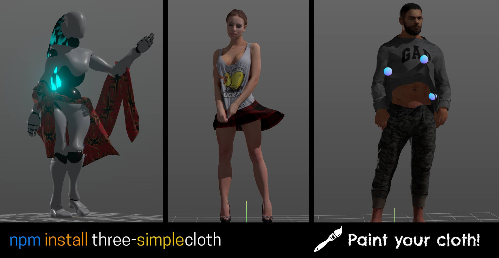
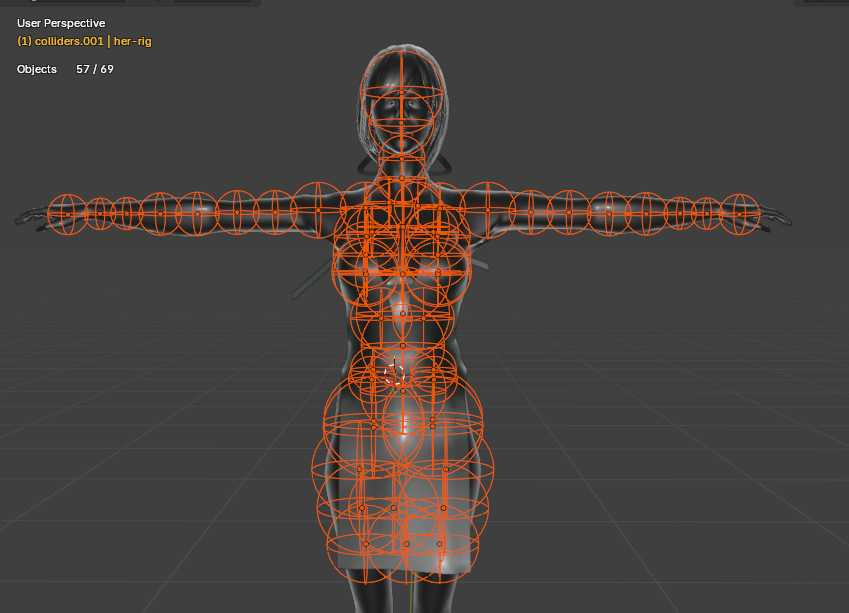
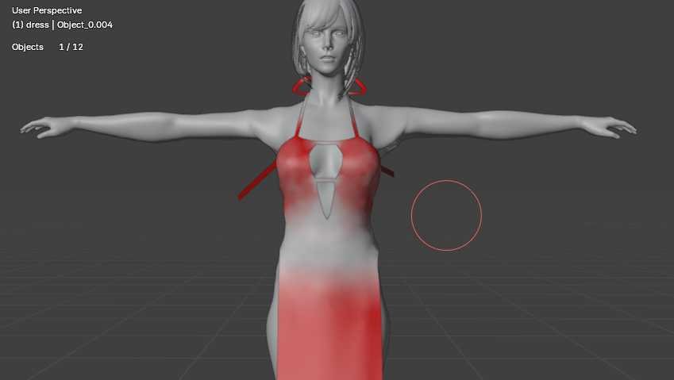

> Based on: https://github.com/mrdoob/three.js/blob/a58e9ecf225b50e4a28a934442e854878bc2a959/examples/webgpu_compute_cloth.html
 



## What is this?
A [Three.js module](https://threejs.org/) you can use to turn pieces of skinned meshes into cloth-like meshes that will move like cloth... kind of. It has support for colliders (spheres) and grabbing and interacting with the cloth.

>Play with the [online demo](https://bandinopla.github.io/three-simplecloth/)

## How does this work?
You skin your mesh normally but then you vertex paint in red color the parts that you want to turn into "cloth" and then when you use this module you basically pass a reference to the mesh that contains this painting and it will turn it into a "cloth like" mesh, blending between normal skinned and cloth using this color as a mask.

It is probably advisable to have the cloth portions as separated meshes, not all one big giant mesh including your character. So for example, if only a small portion should be cloth, try to see if you can separate it and turning into a separated skinned mesh under the same rig. This will avoid calculating on the whole mesh and will be more performant. Obviously all part of the same skeleton as a child of the main rig.

> Read: [Article explaining implementation](https://medium.com/@pablobandinopla/simple-cloth-simulation-with-three-js-and-compute-shaders-on-skeletal-animated-meshes-acb679a70d9f) 


## Install
```bash
npm install three-simplecloth
```

## Usage
Find the examples in the [playground](playground) folder. Initially I did the female bot dancing in main.ts then when I added more examples I wrote separated files for them. So main will contain part of the logic for the dancing robot demo and part of the logic to select the right demo.

```typescript
import { SimpleCloth } from "three-simplecloth";

//
// this will modify the material of the "clothing" Skinned mesh
// and return a handler you must call to update the cloth simulation.
//
const cloth = SimpleCloth.onSkinnedMesh( clothing, renderer, { ...config... } );

function animate(delta: number) {
	cloth.update(delta);
}
```

## Config
The third parameter is a config object:

| Property | Type | Description |
| --- | --- | --- |
| `colorAttributeName` | `string` | Usually it is "color" but sometimes it may be other like "color_1". |
| `logStats` | `boolean` | Log stats to the console ( about the cloth mesh ). |
| `collidersRoot` | `Object3D` | The root object to search for colliders. |
| `stiffness` | `number` | Stiffness of the cloth (0.0 to 1.0). |
| `dampening` | `number` | Dampening of the cloth (0.0 to 1.0). |
| `colliderRadiusMultiplier` | `number` | Tweak the radius of the colliders ( which are spheres attached to bones ). Default is 1.0. |
| `windPerSecond` | `Vector3` | Wind DIRECTION in world space (noise will be used to add variation). |
| `gravityPerSecond` | `Vector3` | Gravity force in world space. |
| `updateMaterial` | `function` | A function to override the current skinned mesh material. It receives the material and 2 TSL nodes: vertexNode and normalNode. 
| `magnets` | `number` | [Optional] How many magnets will interact with the cloth (used for grabbing vertices)

# Adding colliders
The code will scan for objects in `config.collidersRoot` with `userData.stickto="bonename"` OR `userData.clothCollider=true` properties. It will use the scale X and will asume uniform scale, because colliders are spheres. And on every run it will update the position of the colliders so you can move them via code and the cloth will react to them.

You will usually pass a reference to the main rig object to it if you put all your colliders as child of the rig. 

Colliders are spheres, set them up in the areas where you think the cloth may collider. Give some air too so the cloth can move.


In the picture above, each collider has a "stickto" property set to the name of the bone it should stick to. Some will stick to the arm bone, others to the torso, legs, etc... you just copy paste them and change the name to the corresponding bone in the cloth's skeleton.

# Painting cloth
Not everything has to be pure red. You can leave some areas intentionally white to help the fabric stick to the mesh and avoid a complete slip of the cloth ( like a dress totally falling down )


# Magnets: Grabbing the cloth
To create the interaction of grabbing and relesing the cloth the system is designed to, when provided a point in world space, find the closest vertex to that point and "grab" it. Then, you call a callback to release it.

```javascript
// activate magnet at index 0
const grabHandler = yourCloth.activateMagnet( 0, pointInTheSceneOrObject3D );

// later at some point in your code, to move it... 
grabHandler.update(); // use this if you originally passed an object3d that you are moving yourself... this method will sync the position.

// If you want to manually pass the values you can call
grabHandler.updatePosition(x,y,z);

//Then when you want to release it so the vertex go back to normal...
grabHandler.deactivate()
```

# Caveats
The cloth needs a few moments to settle. You have to leave some time in pose mode for the cloth to adjust then fade in into the animation you want. 

 
 # Collab / Improve
 Pull requests welcome. If you can improve the math behind the physics, be my guest. I am not a physics expert, I just wanted to have a simple cloth simulation in three.js that I could use in my projects.
